# Scalpel — My Version

A fork of [Scalpel](https://github.com/scalpelpoe/scalpel) with custom PoE 2 plugins and a built-in craft engine.

---

## Download & play (no build)

**You do not need Node.js, npm, or to compile anything.**

1. Open the latest **[GitHub Release](https://github.com/eniner/Scalpel-My-Version/releases/latest)**
2. Download **`Scalpel-My-Version-*-Windows.zip`**
3. Unzip the folder
4. Double-click **`Install Scalpel.bat`**
5. Use the new Desktop / Start Menu icon **Scalpel My Version**

That copies the app into `%LOCALAPPDATA%\Programs\Scalpel-My-Version`, installs all bundled plugins, creates shortcuts with the Scalpel icon (including OneDrive Desktop), and launches Scalpel.

Portable option (no install copy): double-click **`Launch Scalpel (Portable).bat`** inside the unzipped folder instead.

---

## What you get

| Plugin / feature | Tab / hotkey | Description |
|------------------|--------------|-------------|
| **Scalpel Lab** | Pickaxe tab | PoE 2 crafting lab — simulator, emulator, target odds, craft paths, mod cheat sheet |
| **Scalpel Economy** | Economy tab + overlay | In-game poe.ninja browser (currency, runes, uniques, omens, essences, etc.) |
| **Filter section editor** | Settings → Filter | Browse NeverSink `$type`/`$tier` sections, Show/Hide, drag BaseTypes, style brush, Add rule |
| **Loot simulator** | Settings → Filter | Roll BaseTypes from a section; Fontin labels + alert sounds like a pack drop |
| **Custom tiers** | Settings → Filter + overlay | Pin your own bases into a named tier above FilterBlade / economy rules. Survives online updates. |
| **FilterBlade / OnlineFilters bridge** | Settings → Filter | Open PoE / FilterBlade, Scan & Link shared filters as `*-local.filter` |
| **Runeshape Checker** | Runeshape tab | OCR hotkey that reads Runeshape Combinations rewards and shows poe.ninja prices |
| **Scalpel OCR** (`well-tiers`) | — | OCR hotkey for Well of Souls affix tiers and Runeshape reward pricing |
| **Build Shopping List** | Shopping list tab | Import MaxRoll / Mobalytics builds into a gear checklist with Trade links |
| **Expedition cheat sheet** | Settings → Sheets | PoE 2 rumor / unique map / boss / saga tier list (from community spreadsheet) |
| **Regex cheat sheet** | Settings → Sheets | PoE 2 stash-search operators, number mins, tablet gotchas (Omens etc.) |
| **Scarab Atlas** | Scarabs tab (PoE1) | Block / boost / invest scarab EV optimizer + vendor guide |
| **Timeless Jewels** | Timeless tab + tree overlay (PoE1) | Timeless jewel calculator with skill-tree secondary overlay |
| **Scalpel Warrants** | Warrants tab (PoE1) | Mercenary Warrant market scanner |
| **Scalpel Harvest** | Overlay hotkey (PoE1) | Harvest lifeforce conversion profitability (plugin, E9) |
| **Scalpel Advisor** | Overlay hotkey (PoE1) | Farming EV hub — gems, beasts, scarabs, essences, harvest, bosses, betrayal, scrying (plugin, E9) |

Upstream Scalpel core (price check, regex builder, macros, sheets, etc.) stays intact — this fork layers the addons above on top.

---

## Feature screenshots

### Filter section editor

Browse NeverSink sections on your active `*-local` filter. Toggle Show/Hide per tier, drag BaseTypes between tiers, edit style with the brush, and **Add rule** for a new BaseType.

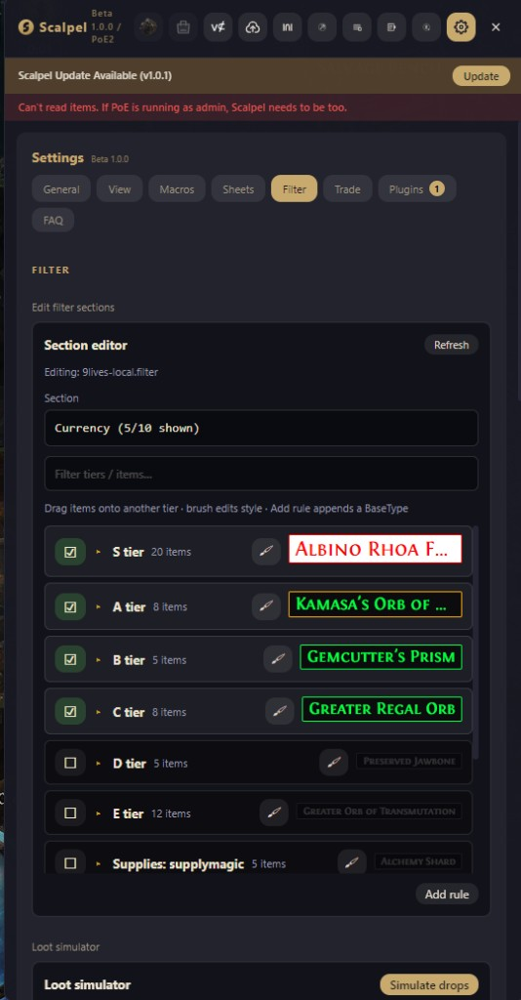

### Loot simulator

Pick a section pool (e.g. Currency), simulate a pack of drops, and preview Fontin labels + alert sounds against your active filter before you map.

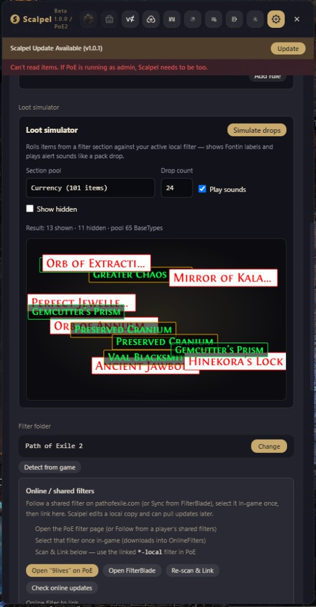

### FilterBlade / OnlineFilters bridge

Link shared PoE / FilterBlade filters without hand-copying files: open the PoE item-filter page or FilterBlade, then **Scan & Link** to create a Scalpel-editable `Name-local.filter`.

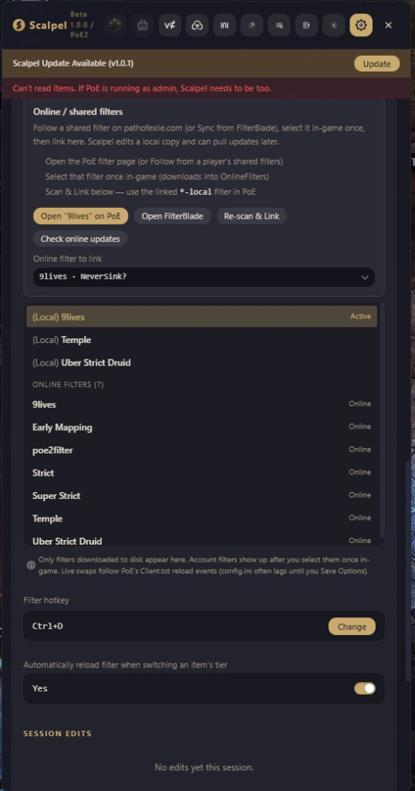

Filter checkpoints and session history stay available under the same Filter tab:

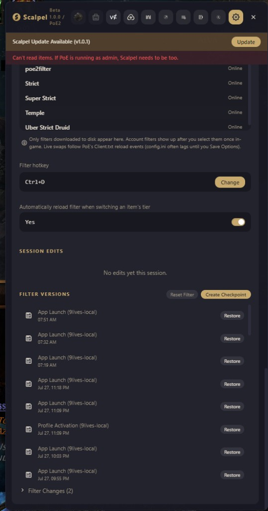

### Scalpel Economy

Live poe.ninja prices in the Economy tab, plus **Open in-game panel** for a pop-out overlay beside PoE while you play.

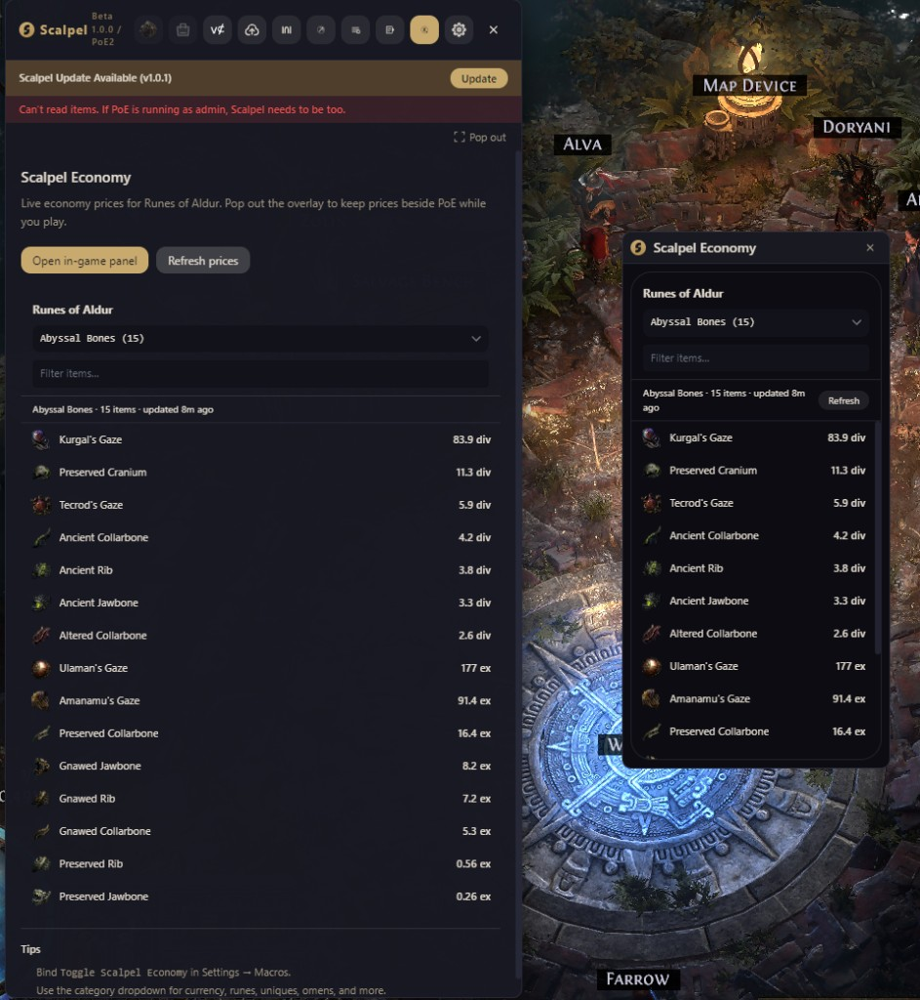

### Build Shopping List

Paste a MaxRoll / Mobalytics URL (or import a `.build` file), then track acquired gear slots with priority stats and Trade / DB links.

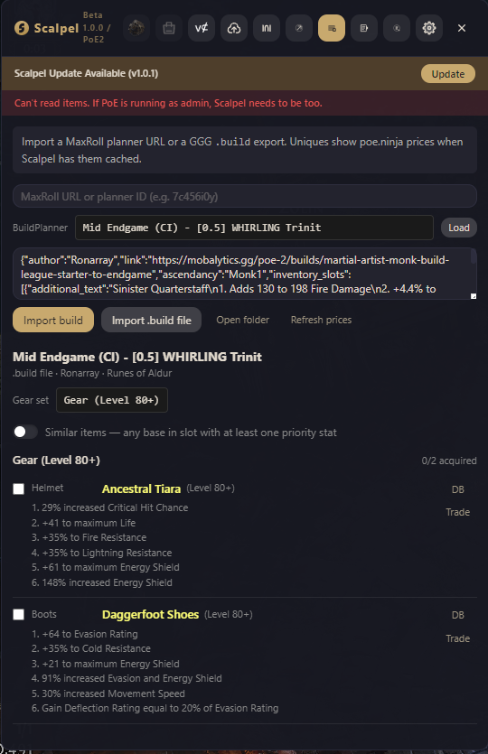

### Scalpel Lab — Craft odds

Per-base prefix/suffix weights for the selected item (iLvl, pool tags, Craft / Marksman / Desecrated).

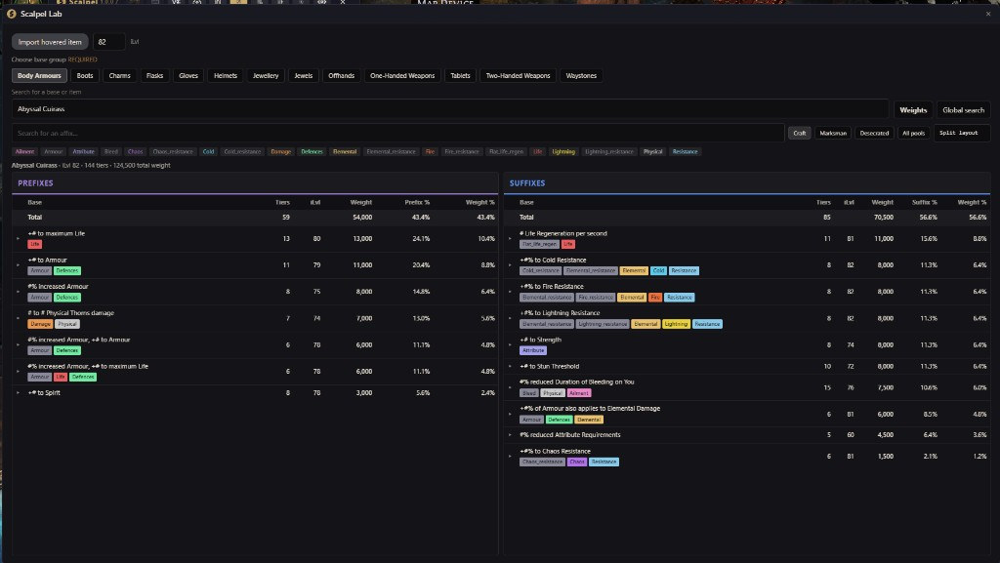

### Scalpel Lab — Emulator

Step-through crafting on a virtual item: omens (Dextral/Sinistral, Whittling, …) plus currencies, essences, and more.

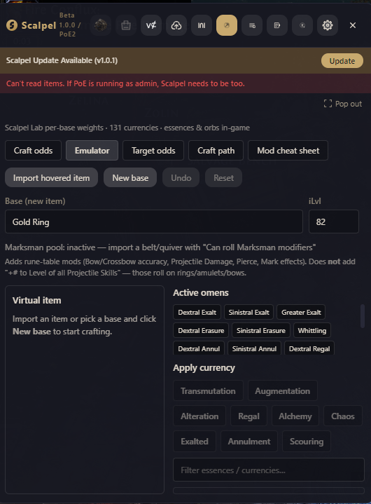

### Scalpel Lab — Target odds

Search a target mod and craft method to see chance to hit (prefix / suffix / any).

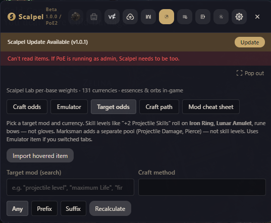

### Scalpel Lab — Craft path

Multi-step recipes (e.g. Alt → Regal) using the Emulator item state when available.

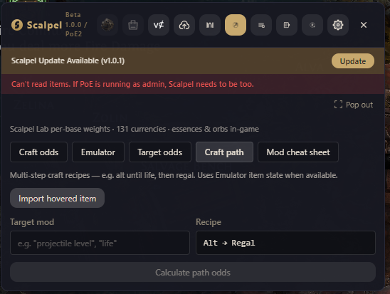

### Expedition cheat sheet

Sheets overlay: rumor / unique map / boss / saga ratings for PoE 2 Expedition.

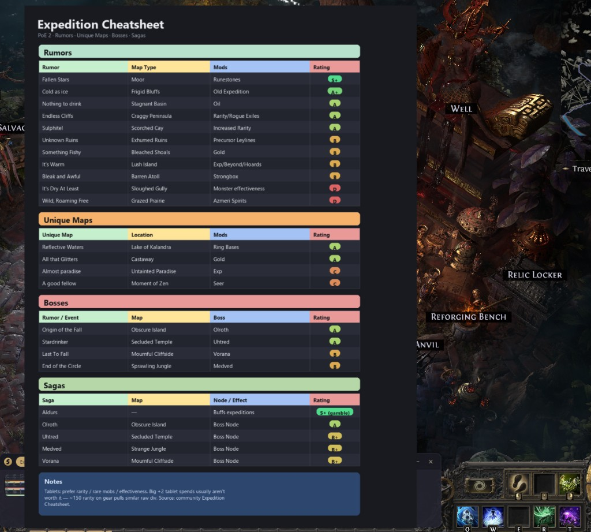

### Regex cheat sheet

Sheets overlay for stash/vendor search: AND/OR/exclude quotes, Want Any vs All, abbreviations, and the ~250-char limit.

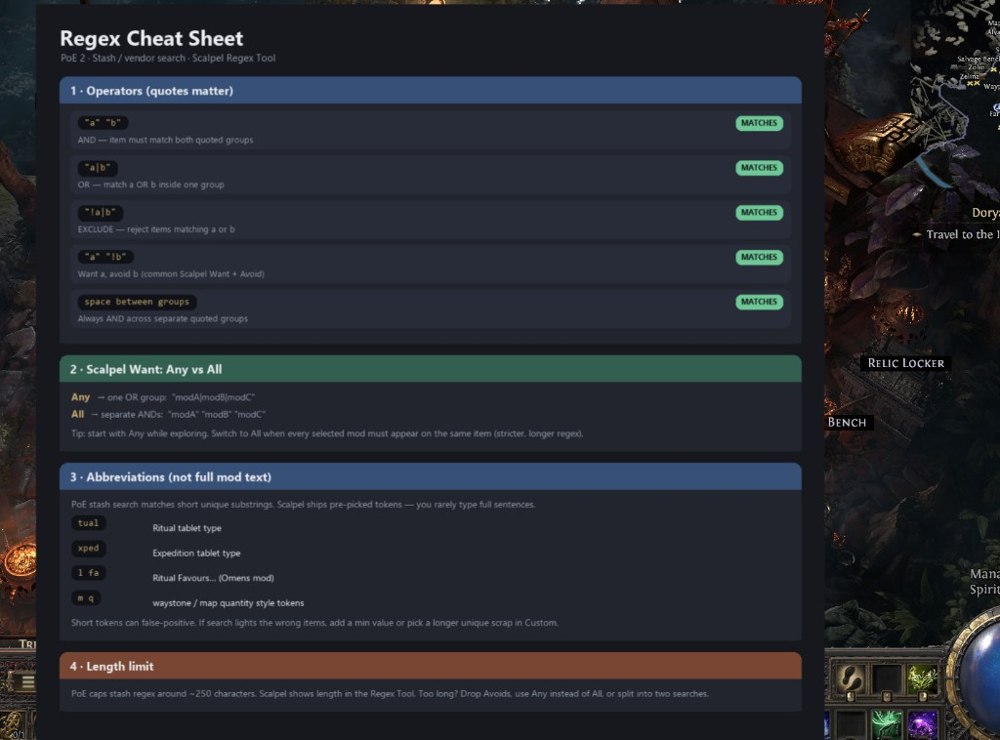

---

## Requirements

### Prebuilt ZIP (recommended)

- **Windows 10/11 x64**
- **Path of Exile** and/or **Path of Exile 2**

### From source (developers only)

- **Windows** (install script targets `%LOCALAPPDATA%\Programs\scalpel`)
- **[Scalpel](https://github.com/scalpelpoe/scalpel/releases)** already installed from the official installer *(only if using `install:local`)*
- **[Node.js 22+](https://nodejs.org/)**
- **Path of Exile 2** (most custom plugins are PoE 2 only)

---

## Install from source (developers)

Use this only if you are developing or prefer to patch an official Scalpel install. Everyone else should use the [Download & play](#download--play-no-build) ZIP above.

### 1. Clone this repo

```powershell
git clone https://github.com/eniner/Scalpel-My-Version.git
cd Scalpel-My-Version
```

### 2. Install dependencies

```powershell
npm install
```

Plugin dependencies are installed automatically when you run `install:local` (below). If you want to install them manually first:

```powershell
Get-ChildItem plugins -Directory | ForEach-Object { npm install --prefix $_.FullName }
```

### 3. Patch your installed Scalpel

**Quit Scalpel completely** (including the system tray icon), then run:

```powershell
npm run install:local
```

This will:

1. Build CoE crafting data and the full app bundle
2. Pack a new `app.asar` with the craft engine + Lab support
3. Replace `%LOCALAPPDATA%\Programs\scalpel\resources\app.asar` (old file backed up as `app.asar.bak-*`)
4. Build and copy **all bundled plugins** into `%APPDATA%\Scalpel\plugins\`:
   - `scalpel-lab`
   - `scalpel-economy`
   - `runeshape-checker`
   - `well-tiers`
   - `build-shopping-list`
5. Launch Scalpel from your normal install

**First build can take several minutes** and needs ~8 GB RAM. If the build fails with “JavaScript heap out of memory”, close other apps and run:

```powershell
$env:NODE_OPTIONS="--max-old-space-size=8192"
npm run install:local
```

### 4. Open Scalpel

Launch **Scalpel** from the Start menu (not a separate dev exe). You should see tabs for **Scalpel Lab**, **Economy**, **Runeshape**, and **Build Shopping List**.

---

## Using Scalpel Economy

1. Set Scalpel to **PoE 2** and your league (Runes of Aldur).
2. Open the overlay and select the **Economy** tab.
3. Click **Open in-game panel** for a sister-style price window beside the game.
4. Bind **Toggle Scalpel Economy** in Settings → Macros to show/hide the overlay quickly.
5. Use the category dropdown for currency, fragments, runes, soul cores, omens, uniques, and more.
6. Click **Refresh prices** to pull the latest poe.ninja data.

Categories mirror the poe.ninja PoE 2 economy pages (currency, fragments, abyssal bones, essences, runes, omens, expedition, liquid emotions, unique weapons/armours/accessories/jewels/flasks, etc.).

---

## Using the Expedition cheat sheet

`install:local` installs the community **Expedition** tier list (rumors, unique maps, bosses, sagas) into your PoE 2 Sheets.

1. Open Scalpel → **Settings → Sheets**
2. You should see an **Expedition** category with **Expedition Tier List**
3. Bind a hotkey on that category (or set the global Sheets hotkey)
4. In game, press the hotkey to open the Sheets overlay and view the tier list

Source spreadsheet: [Expedition Cheatsheet](https://docs.google.com/spreadsheets/d/16YU8mSS7TdLPdmOunVjiPn_NrKVGfcnMkuMQDy8jgZA/edit?gid=0#gid=0)

To regenerate the image after editing the sheet data:

```powershell
python scripts\render-expedition-cheatsheet.py
npm run sync-prefabs
```

Then re-run `npm run install:local` (or copy the PNG into Settings → Sheets).

---

## Using the Regex cheat sheet

`install:local` also installs a two-page **Regex** pack (operators + numbers/gotchas) into PoE 2 Sheets.

1. Open Scalpel → **Settings → Sheets**
2. Find the **Regex** category (Operators · Numbers & Gotchas)
3. Bind a category hotkey (or use the global Sheets hotkey) and flip pages in the overlay

Covers stash AND/OR/exclude quotes, Want Any vs All, abbreviations, the ~250-char limit, min-value patterns, and the tablet “token before number” gotcha (e.g. Omens).

Regenerate:

```powershell
python scripts\render-regex-cheatsheet.py
npm run sync-prefabs
```

Then re-run `npm run install:local`.

---

## FilterBlade / NeverSink bridge

Scalpel does not talk to FilterBlade’s servers (no public API). The bridge is:

1. **Open FilterBlade** from Settings → Filter (or the overlay filter setup panel)
2. On FilterBlade: customize → **Export → Sync** to your PoE account
3. In-game: select that filter once so it downloads into `OnlineFilters`
4. In Scalpel: **Scan & Link** — creates a `Name-local.filter` Scalpel can edit
5. In-game: switch to the `*-local` filter
6. Later: **Check FilterBlade updates** after you re-Sync on the site

---

## Using Scalpel Lab

1. Set Scalpel to **PoE 2** and your league in settings.
2. Open the overlay in game (default hotkey from Scalpel settings).
3. Select the **Scalpel Lab** tab (pickaxe icon).

### Tabs inside Lab

| Tab | Purpose |
|-----|---------|
| **Simulator** | Pick a base and crafting action; see mod roll probabilities |
| **Mod cheat sheet** | Search/filter mod pools and weights for a base |
| **Emulator** | Apply crafts step-by-step on a virtual item |
| **Target odds** | Probability to hit a specific mod (search by name) |
| **Craft path** | Odds for multi-step plans (e.g. spam alts until mod) |

### Import an item from game

- Use the hotkey **Import item → Scalpel Lab** (configure in Scalpel plugin hotkeys), or
- Copy item in game and use Smart Import inside Lab where available.

### Pop-out cheat sheet

In the Lab tab header, click **Pop out** to open the mod cheat sheet in a separate window.

---

## Using Runeshape Checker & Scalpel OCR

### Runeshape Checker

1. Open the **Runeshape** tab for setup and diagnostics.
2. Bind **Price Runeshape rewards** in Settings → Macros.
3. With the Runeshape Combinations panel open in game, press the hotkey.
4. OCR reads each reward row and shows poe.ninja prices beside them.

### Scalpel OCR (`well-tiers`)

1. Bind the Well / Runeshape OCR hotkeys in Settings → Macros (labels shown in plugin settings).
2. For **Well of Souls**, press the hotkey with the well panel open — affix tiers appear beside each mod line.
3. For **Runeshape**, similar OCR pricing overlay (separate from Runeshape Checker tab UI).

---

## Developer workflow (optional)

If you want to hack on plugins or run from source without patching the installer:

```powershell
npm run dev:plugin
```

Or build and launch from the repo without a dev server:

```powershell
npm run launch
```

Or double-click **`Launch Scalpel.bat`** in the repo root (same as `npm run launch`).

---

## Re-install / update after pulling git changes

```powershell
git pull
npm install
npm run install:local
```

Always fully quit Scalpel before running `install:local`.

---

## Troubleshooting

### Orange banner: “Scalpel needs a full restart…”

The craft engine is not loaded. **Quit Scalpel entirely** (tray + all windows) and open it again from the Start menu. If it persists, re-run `npm run install:local`.

### Error: `Cannot find module ... app.asar\out\main\index.js`

The patched `app.asar` is broken (incomplete build). Restore from backup:

```powershell
# Find the newest backup
dir $env:LOCALAPPDATA\Programs\scalpel\resources\app.asar.bak-*

# Restore (replace TIMESTAMP with your backup name)
Copy-Item "$env:LOCALAPPDATA\Programs\scalpel\resources\app.asar.bak-TIMESTAMP" `
  "$env:LOCALAPPDATA\Programs\scalpel\resources\app.asar" -Force
```

Then re-run `npm run install:local` with `$env:NODE_OPTIONS="--max-old-space-size=8192"`.

### Plugin tab missing (Economy, Lab, Runeshape, etc.)

Check `%APPDATA%\Scalpel\plugins\installed.json` includes the plugin id (e.g. `"scalpel-economy"`). Re-run `npm run install:local`.

### Official Scalpel auto-update overwrote Lab

The built-in updater may replace `app.asar` with a release that does not include the craft engine. Re-run:

```powershell
npm run install:local
```

The install script also updates the pending update staging folder so restarts are less likely to revert the patch.

---

## Project layout

```
plugins/scalpel-lab/          Scalpel Lab (crafting UI)
plugins/scalpel-economy/      poe.ninja economy browser
plugins/scalpel-harvest/      PoE1 Harvest conversion profitability (E9)
plugins/scalpel-advisor/      PoE1 farming EV tools hub (E9)
plugins/scalpel-warrants/     PoE1 Mercenary Warrant market scanner (eniner)
plugins/runeshape-checker/     Runeshape OCR pricing
plugins/well-tiers/            Well of Souls + Runeshape OCR
plugins/build-shopping-list/   Build guide shopping list
src/renderer/.../scarab-atlas/ Scarab Atlas tab (PoE1)
src/renderer/.../timeless-*/   Timeless Jewels + tree overlay (PoE1)
screenshots/              Feature screenshots used in this README
src/shared/crafting/           Craft engine (host)
src/main/handlers/             Craft IPC handlers
scripts/install-to-local-scalpel.mjs   Patch normal Scalpel install
```


---

## License

Based on [Scalpel](https://github.com/scalpelpoe/scalpel) — **AGPL-3.0-only**. Custom plugin additions follow the same license. You must comply with AGPL if you distribute modified versions.

---

## Credits

- [Scalpel](https://github.com/scalpelpoe/scalpel) — Kyusung / Scalpel team
- Mod weight data — Craft of Exile–style dataset (built via `npm run build-coe-crafting-data`)
- Scalpel Lab, Economy, Runeshape, OCR plugins — E9ine_AC
